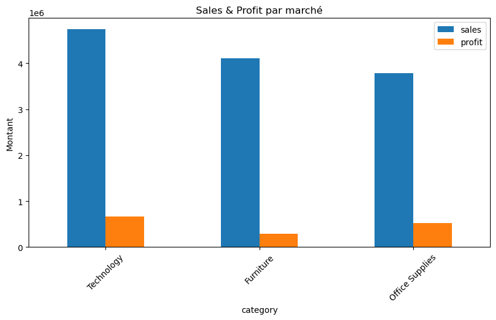

# 📊 E-commerce Sales Analysis (Superstore Dataset)

## 🎯 Objective

The goal of this project is to analyze an e-commerce dataset to identify key drivers of sales and profitability, and provide actionable business insights.

---

## 📁 Dataset

* Source: Kaggle Superstore Dataset
* 50,000+ transactions
* Includes sales, profit, discounts, customer segments, regions, and products

---

## 🛠️ Tools & Technologies

* Python
* Pandas
* Matplotlib / Seaborn
* Jupyter Notebook

---

## 📊 Key Analyses

### 🔹 Sales & Profit Overview

* Computed total revenue, profit, and average order value
* Identified overall business performance

### 🔹 Customer Segmentation

* Consumer segment contributes over **50% of total revenue**
* Corporate segment shows strong potential

### 🔹 Product Analysis

* Technology is the most profitable category
* Some sub-categories generate consistent losses

### 🔹 Discount Impact

* Strong negative correlation between discounts and profit
* High discounts often lead to financial losses

### 🔹 Geographic Analysis

* Identified top-performing markets and regions

### 🔹 Shipping & Operations

* Standard Class is the most used shipping mode
* Majority of orders have medium priority

---

## 🔥 Key Insights

* 💰 Revenue is highly concentrated in the Consumer segment (~51%)
* ⚠️ High discounts significantly reduce profitability
* 📉 Some products generate losses and should be reviewed
* 🌍 Sales performance varies significantly by region

---

## 📌 Business Recommendations

* Optimize discount strategy to protect margins
* Focus on high-value customer segments
* Reassess underperforming product categories
* Expand in high-performing regions

---

## 📂 Project Structure

* `Superstore-Sales-Analysis
.ipynb` → main analysis notebook
* `README.md` → project description

---

## 🚀 Conclusion

This project demonstrates how data analysis can support business decision-making by identifying key performance drivers and improvement opportunities.

---
